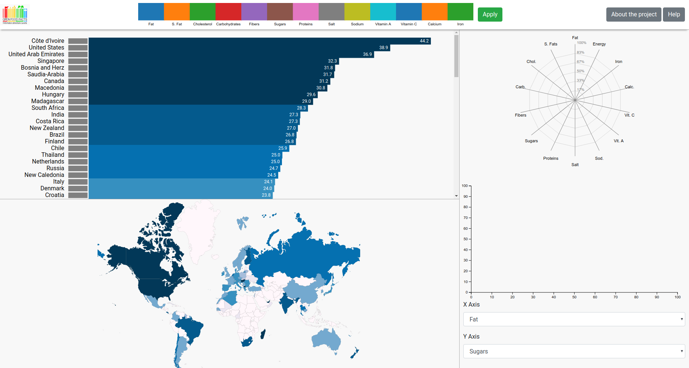
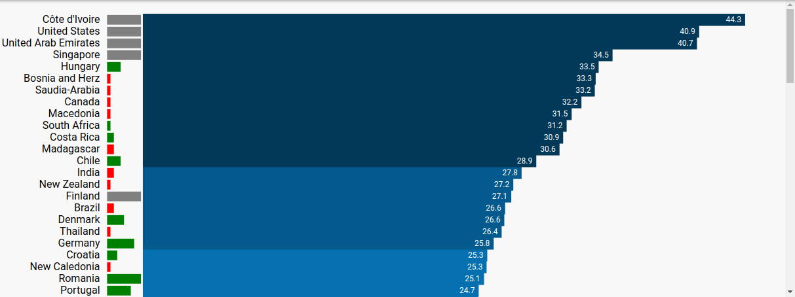
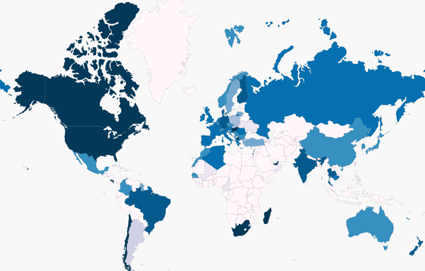
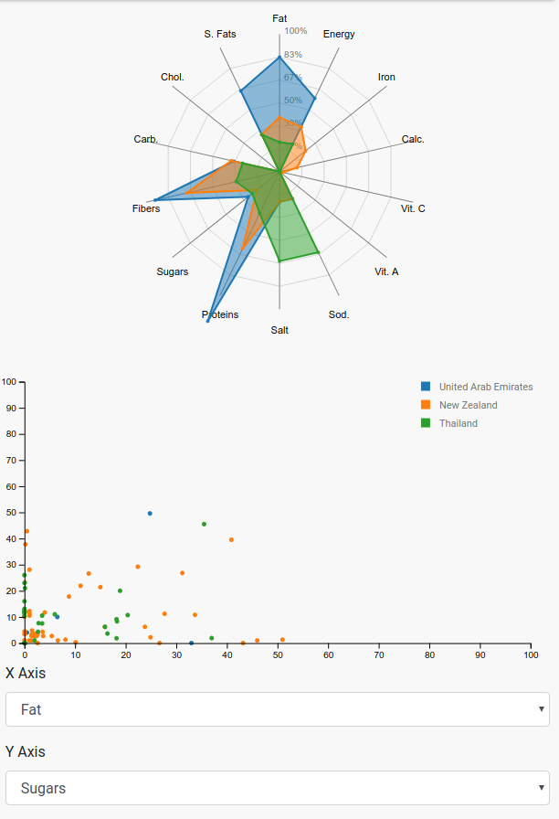

# What You Eat Is Who You Are

Authors : [ALLIER Raphaël](https://github.com/RaphAllier), [BOULERY Jérémy](https://github.com/Jboulery), [CARRA Valentin](https://github.com/ValentinCrr)

Link : https://jboulery.github.io/wyeiwya/index.html

## Introduction

What you eat is who you are ! Ever wonder which country eats the healthiest food ? You're going on a trip to Phillipines and you worry that you won't be able to keep on with your diet ? This data visualization project will give you all the answers.

Based on a database provided by [OpenFoodFacts](https://world.openfoodfacts.org/), we created a D3 visualization that allows you to see which country in the world eats the fattest food or the sweetest one, and much more features.

## Data source

The original dataset and problem comes from [this Kaggle topic](https://www.kaggle.com/openfoodfacts/world-food-facts). Basically, [OpenFoodFacts](https://world.openfoodfacts.org/) provides a large dataset supplemented by various users, consisting of 
food products from all round the world. For each product, there are a lot of fields and attributes that reflect its nutrionnal values, its name, its labels, nutrition score, additives, etc...

Out of all of those, we only kept 15 fields, including the origin of the product, its energy, and its main nutritional values per 100 grams.

## Presentation video

A presentation video of this projects, featuring the various functionalities of the page is available [here](https://www.youtube.com/watch?v=eJ4Af0J4mxE&feature=youtu.be).

## Design and technical choices

### General Design

The project page has been divided is four different parts : a navbar which contains a multirange slider, a ranking table where countries are sorted depending on a given score, a world map which displays the information geographically based on color, a right sidebar containing a spider and a scatterplot chart.
This design ensures to display clearly the information based on our original dataset in few space. Bootstrap has been used for its grid system and to ease our different parts management (css, js, responsiveness) and specifically the navbar and the sidebar ones.

<table border="0">
  <tr>
    <td>
      
    </td>
  </tr>
  <tr>General Design</tr>
</table>

### Multirange Slider

It is the main component of the top navbar of the project page. All products have 13 attributes each (fat per 100g, sugars per 100g, cholesterol per 100g, ...) and this slider enables the user to adjust the weight of any of these attributes. A weights modification is done once the button "Apply" is clicked, it immediately updates the scoring for each country based on the different multirange slider zones proportions. 

As no adapted solution for multirange sliders had been found, it has been nearly developed entirely (it is still based on [a simple slider](https://bl.ocks.org/mbostock/6452972)).

<table border="0">
  <tr>
    <td>
      
    </td>
  </tr>
  <tr>Multirange Slider after modification</tr>
</table>

### Ranking Table

This is the main part of the project page and it displays the current countries ranking. The latter is based on a score computed with the different product attributes weights given by the multirange slider.
As the user scrolls among the table, he will notice that the bars colors (which vary from light to dark blue) depends on the current rank of a country. 

A weight modification in the top bar implies the ranking to be dynamically updated. This modification is clearly visible : bars move vertically to their new place and this transition move is stored as a visual information (a green or red rectangle) just next to countries name. If a country has moved up in the ranking its transition move indicator is green and its width is related to the difference between its previous and new ranks.
Each bar is clickable and as a country has been selected, its bar become green to notify the user. 

<table border="0">
  <tr>
    <td>
      
    </td>
  </tr>
  <tr>Ranking after weights update</tr>
</table>

### World Map

As users may want to see geographical dependencies between diets, this part displays the ranking information on a world map. Each country color is the same as used in the ranking table. When hovering a country, a tooltip is displayed and shows additional information.
The map is zoomable and movable which enables the user to better interact with small countries or to center the map where he wants.

<table border="0">
  <tr>
    <td>
      
    </td>
  </tr>
  <tr>World Map</tr>
</table>

### Spider and Scatterplot Charts

These charts are updated as countries are selected in the ranking table. The spider chart displays products attributes means for the selected countries and enables to compare how different their diets are in average.

The scatterplot chart is charged if showing products distribution for each countries. When a country is selected, its products are added to the chart which let the user know if outliers are present in the dataset for example. X and Y axis can be modifies thanks to two list selectors below the chart.  

<table border="0">
  <tr>
    <td>
      
    </td>
  </tr>
  <tr>Right Sidebar with spider and scatterplot charts</tr>
</table>

## Troubleshooting

### Loading Time

Nearly 20Mb of preprocessed data are loaded when the page is refreshed, that's why it takes two seconds at the beginning. Since the data is loaded only once, the project team has decided that this was acceptable. Even if charts are updated really quickly in general, some countries (e.g USA and France) whom number of registered products may be over 100k lead to decreased performance.

### Draggable Multirange Slider

As it is entirely customed, this slider detects the nearest zone border given a clicked point. That's why, at the moment, it is painful when a user want a specific zone to be very large.

## Resources and credits

- [Interactive Data Visualization course (ECL MOS 5.5) - Romain Vuillemot](https://github.com/LyonDataViz/MOS5.5-Dataviz)

- [D3.js - Radar Chart or Spider Chart - Adjusted from radar-chart-d3 - Nadieh Bremer](http://bl.ocks.org/nbremer/6506614)

- ["Unemployment ranked with horizontal bars" block - Leon du Toit](http://bl.ocks.org/leondutoit/6436923)
